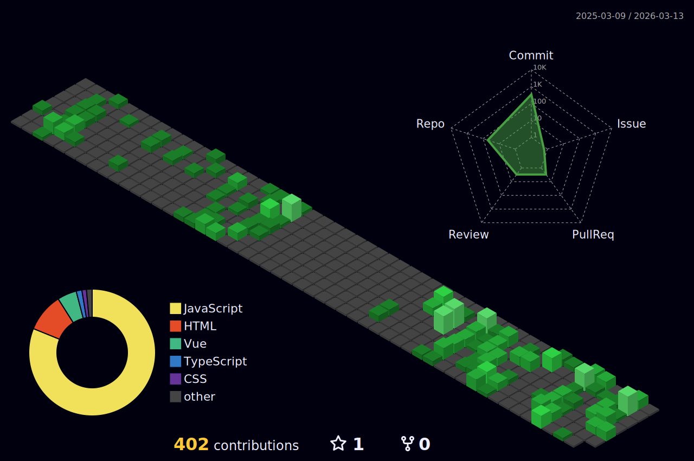

---

# 👋 About Me

Hi, I’m **Sanjeevappa Gari Naresh**, a passionate **Frontend / MERN Stack Developer** focused on building **modern, scalable and production-ready web applications**.

I enjoy crafting **clean UI, scalable backend APIs, and full-stack applications** using modern technologies.

✔ Responsive UI  
✔ REST APIs  
✔ MERN Stack Applications  
✔ Scalable Architecture  
✔ Production Deployment  

🎯 **Open to Frontend / MERN Stack Developer Roles**

---

# 🌟 Highlights

🏆 MERN Stack Developer  
🚀 Built multiple real-world full-stack applications  
🧠 Continuous learner and problem solver  
💼 Open to frontend and full-stack opportunities  

---

# 🌐 Portfolio

🔗 Portfolio  
https://nareshsanjeeevportfolio.netlify.app/

🔗 GitHub  
https://github.com/naresh043

---

# 📄 Resume

---

# 💬 Developer Quote

---

<h2 align="center">
🚀 PROJECTS
</h2>

---

# 🧠 Tech Stack

---

# 🔋 Skill Levels

React        ███████████░ 90%  
JavaScript   ██████████░░ 85%  
Redux        █████████░░░ 80%  
Node.js      █████████░░░ 80%  
MongoDB      ████████░░░░ 75%  
Express.js   ████████░░░░ 75%  

---

# 🚀 Featured Projects

---

## 📦 Inventory & Order Management System

**Role-Based Full-Stack Web Application**

• Built scalable inventory and order management dashboards  
• Implemented JWT authentication and role-based access control  
• Roles: Admin, Sales, Warehouse, Viewer  
• Inventory tracking and order lifecycle management  
• Pagination, search and filtering for large datasets  
• Reusable UI with Prime React and Tailwind CSS  

**Tech Stack**

React  
Redux Toolkit  
RTK Query  
Prime React  
Tailwind CSS  
Node.js  
Express.js  
MongoDB  
JWT  

🌐 Live  
https://inventory-orders-management-system.netlify.app/login

💻 GitHub  
https://github.com/naresh043/Inventory-OrderManagementSystem-

---

## 🎓 E-Tech – Full Stack E-Learning Platform

• Built a full-stack e-learning platform  
• Implemented authentication with JWT  
• Protected routes for enrolled users  
• Course browsing and enrollment system  
• Responsive UI built with React and Redux  

**Tech Stack**

React  
Redux Toolkit  
Node.js  
Express.js  
MongoDB  
JWT  
REST APIs  

🌐 Live  
https://e-learnify-nine.vercel.app/

💻 GitHub  
https://github.com/naresh043/react-project

---

# 📊 GitHub Activity

---

# 🌌 3D Contribution Graph

---

# 🐍 Contribution Snake

---

# ⏳ Career Timeline

• **2024** — Started learning MERN Stack Development  
• **2024** — Built React and Frontend Projects  
• **2025** — Full-Stack Internship and Real Projects  
• **2026** — Advanced MERN Stack Applications  

---

# 🧠 What I Focus On

✔ Building scalable MERN stack applications  
✔ Clean and reusable component architecture  
✔ Secure authentication and authorization  
✔ REST API integration  
✔ Responsive and modern UI  

---

# 📬 Connect With Me

📧 Email  
naresh732003@gmail.com  

💼 LinkedIn  
https://www.linkedin.com/in/nareshsanjeev  

💻 GitHub  
https://github.com/naresh043  

🌐 Portfolio  
https://nareshsanjeeevportfolio.netlify.app/

📱 Mobile  
+91 9703328790

---

# 👀 Visitor Counter

---

# 🏁 License

MIT License — free to use, fork & modify.

---

⭐ Built with passion by <b>Sanjeevappa Gari Naresh</b>

